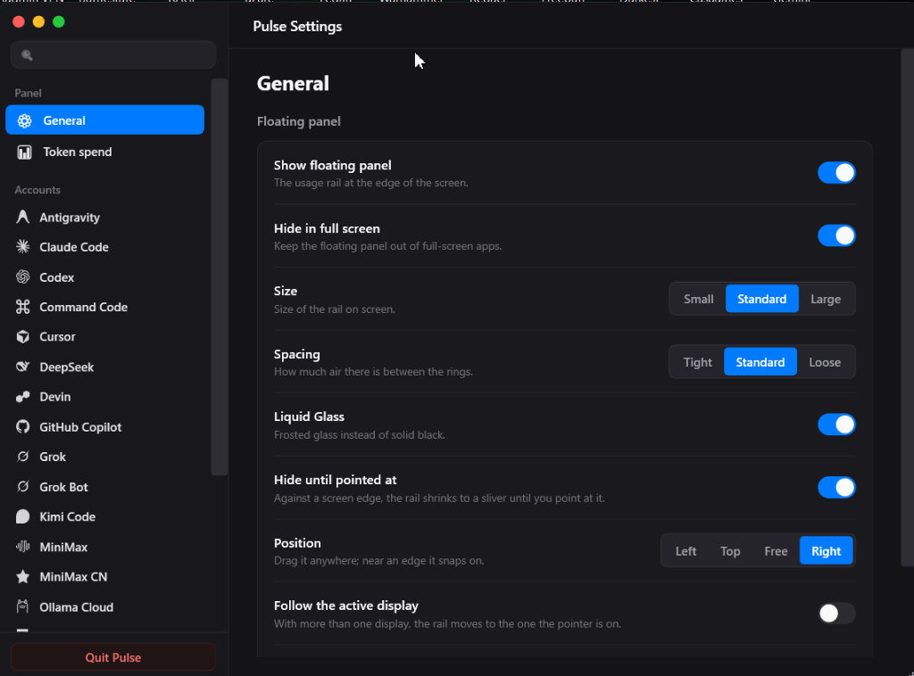
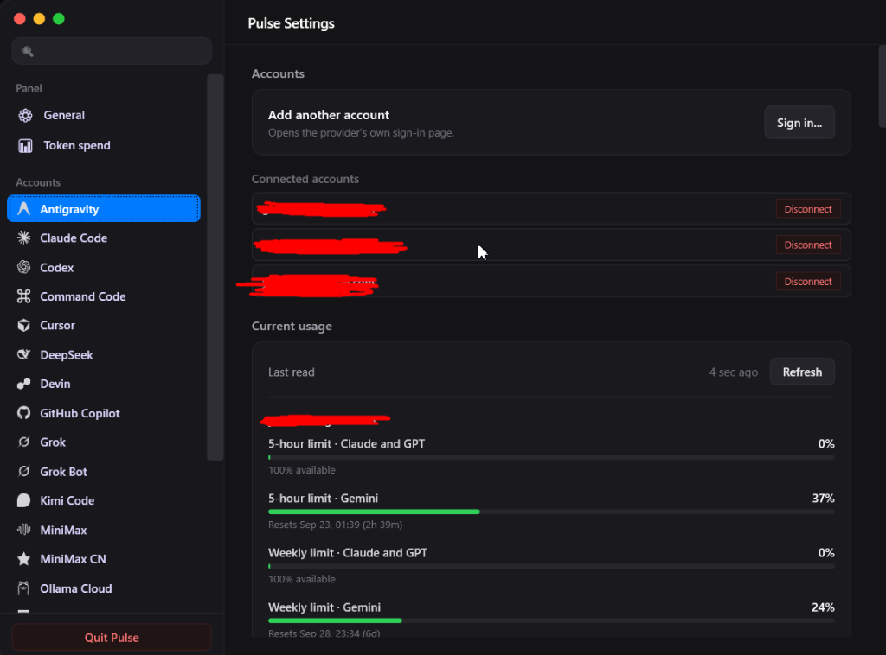
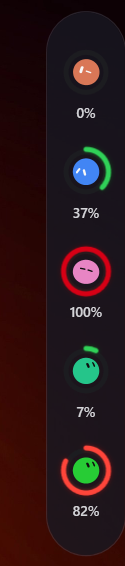

<p align="center">
  
</p>

<h1 align="center">Pulse for Windows (WinPulse)</h1>

<p align="center">
  <b>A lightweight, elegant screen-edge monitor for your AI coding allowances on Windows.</b><br>
  Real-time remaining quotas and rate limits for Antigravity, Claude Code, Codex, Cursor, GitHub Copilot, Grok, DeepSeek, and more.
</p>

<p align="center">
  <a href="https://github.com/yava-code/WinPulse/releases/latest"></a>
  
  
  
  
  <a href="https://github.com/qunqin24/Pulse"></a>
  <a href="LICENSE"></a>
</p>

---

> [!NOTE]
> ### 🪟 Windows Port & Attribution
> This repository is a native Windows port and fork inspired by **[Pulse for macOS](https://github.com/qunqin24/Pulse)** created by [qunqin24](https://github.com/qunqin24), with UI concept originally designed by [**Vinz** (@hivinz_)](https://x.com/hivinz_).
> 
> WinPulse brings the entire Pulse experience to **Windows 10 and 11** built natively in **C# / .NET 10 and WPF**, featuring hardware alpha compositing, screen-edge docking, animated BotMark mascot physics, and exclusive **Antigravity Multi-Profile** support.

---

## ⚡ Quick Install (One Command)

Install and run Pulse on Windows with a single PowerShell command:

```powershell
irm https://raw.githubusercontent.com/yava-code/WinPulse/main/install.ps1 | iex
```

*What this does: downloads the latest standalone release from GitHub, installs to `%LOCALAPPDATA%\Pulse`, creates Start Menu and Desktop shortcuts, and launches Pulse immediately.*

---

## 📦 Download Releases

Pre-built binaries are available under [GitHub Releases](https://github.com/yava-code/WinPulse/releases/latest):

| Asset | Type | Description |
| :--- | :--- | :--- |
| **`Pulse.Windows.exe`** | **Standalone Portable** | **Zero dependencies required!** Self-contained single-file executable, ready to double-click and run on any Windows 10/11 machine. |
| **`Pulse-Windows-x64.zip`** | Portable Archive | Complete portable package containing `Pulse.Windows.exe`. |
| **`Pulse-Windows-x64-framework-dependent.zip`** | Lightweight Package (~2 MB) | For developers who already have [.NET 10 Desktop Runtime](https://dotnet.microsoft.com/download) installed. |

---

## 📸 Screenshots & Showcase

<p align="center">
  
  &nbsp;
  
</p>

<p align="center">
  
  <br>
  <em>Screen-edge floating rail with live BotMark status rings docked to your display edge</em>
</p>

<p align="center">
  
  &nbsp;&nbsp;&nbsp;&nbsp;
  
</p>

---

## 🌟 What Makes Pulse Special

Pulse is an unobtrusive floating monitor that docks neatly along the edge of your screen. It shows remaining allowances from the figures each service reports — using that product's own client routes, not a Pulse server — signed in as you already are, with nothing reported back. Every percentage on screen is a figure the service itself reported.

### 🚀 Exclusive to this Fork: Antigravity Multi-Profile Support
Unlike standard single-session monitors, this Windows port features full **multi-account discovery and management for Antigravity (Google)**:
- **Multiple Concurrent Accounts**: Add and monitor multiple Google / Antigravity accounts simultaneously.
- **Dedicated Quota Pools**: Tracks 5-hour limits (Claude/GPT, Gemini) and weekly quotas for each connected profile independently.
- **Independent Rings & Status**: Display separate rings on the rail for each active account or switch seamlessly between profiles.
- **Dynamic Local Discovery**: Automatically detects existing active sessions from `%USERPROFILE%` and `%APPDATA%` or securely links via Google OAuth.

### 🎯 Core Features
- **At-a-Glance Status Rings**: Dynamic color gradients shift from green to amber, red, and deep red as allowances deplete.
- **BotMark Mascot Physics**: 1:1 vector implementation of the BotMark animated mascot face reacting with squash-and-stretch kinematics to agent activity and quota cooldowns.
- **Hover Detail Cards**: Hover over any status ring to reveal full pool breakdowns, reset countdowns, and window states.
- **Accurate Proportional Progress**: Perfectly calibrated progress tracks ensuring 100% exhaustion fills 100% of the bar across all Windows display scaling modes (100%, 125%, 150%, 175%, 200%).
- **Fluid Screen-Edge Docking**: Dock to the right or left edge of any screen, or let it float freely. Automatically folds into an ultra-thin sliver bar until pointed at.
- **Multi-Monitor Aware**: Automatically tracks the active monitor or stays anchored to your preferred display.
- **Liquid Glass & Obsidian Themes**: Native DirectX layered alpha compositing for frosted glass aesthetics without window clipping or rectangular visual artifacts.
- **Windows DPAPI Security**: Credentials, API tokens, and session secrets are encrypted using the Windows Data Protection API (`ProtectedData`), hardware-backed and scoped strictly to your user profile.
- **Rock-Solid Lifecycle**: Kills old zombie/hung background instances upon start, and forcibly cleans up its process tree upon exit (`Ctrl+Q`, tray exit, or Settings quit).
- **English System Tray Integration**: Right-click the notification area icon for quick settings, quota refresh, and rail visibility controls.
- **CLI & Scripting Mode**: Run `Pulse.Windows.exe --json` for lightweight terminal status bars (Komorebi, GlazeWM, Zebar, or custom PowerShell scripts) without running the GUI.

---

## 🔌 Supported Providers

| Provider | Authentication & Discovery | Monitored Quota |
| :--- | :--- | :--- |
| **Antigravity** | **Multi-Profile** Google OAuth or local token | 5-hour limit (Claude & GPT), 5-hour limit (Gemini), Weekly quotas |
| **Claude Code** | Local credentials (`~/.claude`) | 5-hour and 7-day allowances, active turn indicator |
| **OpenAI Codex** | Local config or ChatGPT session | 5-hour allowance, active agent turn indicator |
| **Cursor** | Local editor session storage | Fast request allowance & subscription usage |
| **GitHub Copilot** | GitHub Device Code authentication | Premium request allowance & model pool |
| **DeepSeek** | Direct API key | Real-time balance and usage tracking |
| **Grok / Grok Bot** | Browser session / token | Rate limits and message pool allowances |
| **Devin** | Local browser session / state | Daily and weekly usage allowances |
| **Kimi Code** | Direct API key | Token allowances and rate limits |
| **MiniMax** | Direct API key | International & mainland storefronts |
| **Ollama Cloud** | Local browser session | Cloud allowance and quota tracking |

---

## 🛠️ Build & Development Guide

### Prerequisites
- Windows 10 (1809+) or Windows 11 (x64 / ARM64)
- [.NET 10.0 SDK](https://dotnet.microsoft.com/download)

### 1-Command Local Build
Use the included automated build script from the repository root:

```powershell
# Build standalone self-contained executable & zip into dist/
.\build.ps1

# Or build lightweight framework-dependent package
.\build.ps1 -FrameworkDependent
```

### Manual dotnet CLI Build & Test
```powershell
# 1. Restore dependencies
dotnet restore Windows/Pulse.slnx

# 2. Run automated unit tests (34 tests passing)
dotnet test Windows/Pulse.slnx

# 3. Publish standalone single-file Release binary
dotnet publish Windows/Pulse.Windows/Pulse.Windows.csproj -c Release -r win-x64 --self-contained true -p:PublishSingleFile=true -o dist/
```

### Command Line Options
```powershell
# Print current cached quota readings as JSON (zero background overhead)
.\dist\Pulse.Windows.exe --json

# Launch in console debug mode to inspect real-time provider sync logs
.\dist\Pulse.Windows.exe --debug

# Start directly to system tray and floating rail without opening Settings window
.\dist\Pulse.Windows.exe --minimized
```

---

## 🏷️ Commits & Release Guide

### Commit Message Conventions
We follow Conventional Commits:
- `feat: add new provider support`
- `fix: resolve liquid glass clipping on secondary monitor`
- `docs: update installation instructions and screenshots`

### Pushing Changes
```powershell
git add .
git commit -m "feat: your descriptive message"
git push winpulse main
```

### Triggering an Automated GitHub Release
Pushing a semantic version tag triggers the GitHub Actions release workflow:

```powershell
# 1. Tag the release
git tag -a v1.0.0 -m "Release v1.0.0"

# 2. Push tag to GitHub
git push winpulse v1.0.0
```
*GitHub Actions will automatically build the standalone single-file `Pulse.Windows.exe`, package `Pulse-Windows-x64.zip`, and publish the GitHub Release.*

---

## 📜 Attribution & License

- **Windows Port & Fork**: Maintained in [yava-code/WinPulse](https://github.com/yava-code/WinPulse).
- **Original macOS Application**: Created by [qunqin24](https://github.com/qunqin24) at [qunqin24/Pulse](https://github.com/qunqin24/Pulse).
- **UI Design Concept**: Inspired by [Vinz (@hivinz_)](https://x.com/hivinz_).
- **License**: Licensed under [Apache 2.0](LICENSE).
