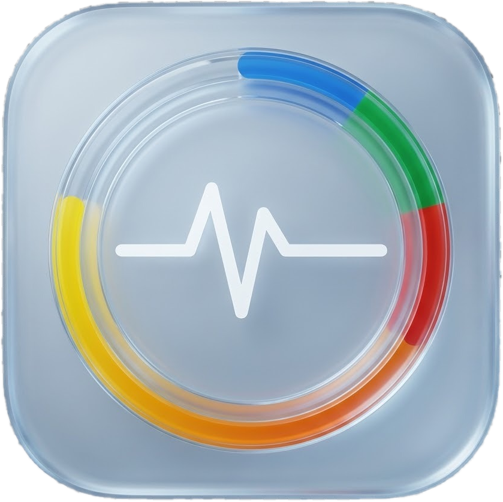

# Pulse for Windows (Native Port)

<p align="center">
  
</p>

<p align="center">
  <b>Native Windows 10 & 11 port of <a href="https://github.com/qunqin24/Pulse">Pulse by qunqin24</a>.</b><br>
  Real-time remaining quotas and rate limits for Claude Code, Codex, Cursor, GitHub Copilot, Antigravity, Grok, DeepSeek, and more.
</p>

<p align="center">
  
  
  
  
  
</p>

---

## Attribution & Origins
This project is an authentic, 1:1 native Windows port and fork of the macOS application **[Pulse](https://github.com/qunqin24/Pulse)** created by [qunqin24](https://github.com/qunqin24). Original design inspiration credited to [Vinz (@hivinz_)](https://x.com/hivinz_).

---

## Features
- **Unobtrusive Screen-Edge Rail**: Docks to the right or left edge of your screen with smooth auto-collapse into an ultra-thin sliver bar.
- **BotMark Mascot Physics**: 1:1 vector implementation of the BotMark animated mascot face reacting with squash-and-stretch kinematics to quota exhaustion and active agent states.
- **Accurate Quota Progress**: Proportional progress bars ensuring 100% exhaustion accurately fills 100% of the visual track at any screen scaling or resolution.
- **Liquid Glass & Obsidian Themes**: Native DirectX layered alpha compositing support for frosted glass without rectangular artifacts or window clipping bugs.
- **Windows DPAPI Storage**: Credentials, API tokens, and OAuth keys are encrypted using the Windows Data Protection API (`ProtectedData.Protect`), hardware-backed and scoped strictly to your user profile.
- **Multi-Account Discovery**: Dynamic discovery of multiple Antigravity sessions and local config credentials (`%APPDATA%`, `%USERPROFILE%`, Claude Code, Codex, Cursor).
- **System Tray Integration**: Full notification area support with live status, quota refresh, and quick settings toggling.
- **Rock-Solid Lifecycle**: Kills previous zombie/hung background instances upon start, and forcibly cleans up its own process tree upon exit (`Ctrl+Q`, tray exit, or Settings quit).
- **Zero-GUI CLI Mode**: Run `Pulse.Windows.exe --json` for lightweight scripting with tmux, Komorebi, or custom terminal statusbars.

---

## Solution Structure
- **`Pulse.Core`**: Shared .NET 10 class library containing:
  - Account and usage models (`ProviderUsage`, `UsageWindow`, `AccountKey`)
  - Provider service integrations (`Antigravity`, `ClaudeCode`, `Codex`, `Cursor`, `Copilot`, `Grok`, `DeepSeek`, etc.)
  - DPAPI credential store interfaces and OAuth authentication flows
  - BotMark mascot mood and persona state engines
- **`Pulse.Windows`**: Native WPF desktop application:
  - `FloatingRailWindow`: Screen-edge floating capsule window
  - `SettingsWindow`: macOS-style multi-pane preferences window
  - `Controls/`: BotMark vector canvas, usage rings, and detail popup cards
  - `Platform/`: Theme management and icon geometry
  - `SystemIntegration/`: Win32/DWM window styling and system tray manager
- **`Pulse.Tests`**: Automated unit test suite verifying rate limit parsers, tint algorithms, and DPAPI encryption.

---

## Getting Started

### Prerequisites
- Windows 10 (Build 1809+) or Windows 11
- [.NET 10 SDK](https://dotnet.microsoft.com/)

### Building and Running
```powershell
# Restore & build Release binary
dotnet build Pulse.Windows/Pulse.Windows.csproj -c Release

# Run automated tests
dotnet test Pulse.Tests/Pulse.Tests.csproj

# Run application
dotnet run --project Pulse.Windows/Pulse.Windows.csproj
```

### Command Line Flags
- `--json`: Dumps the current cached quota readings as JSON to standard output and exits immediately.
- `--debug` / `-d` / `--console`: Attaches to parent console and prints verbose diagnostic logs during startup and sync.
- `--minimized` / `--daemon`: Starts directly to system tray and floating rail without displaying the Settings window on launch.

---

## License
Licensed under [Apache 2.0](https://www.apache.org/licenses/LICENSE-2.0). All original assets retain their respective licenses.
